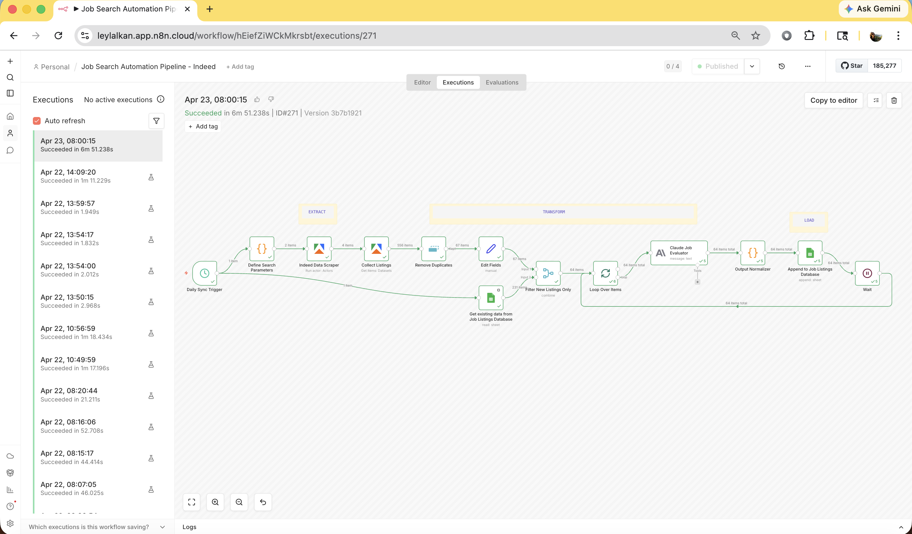
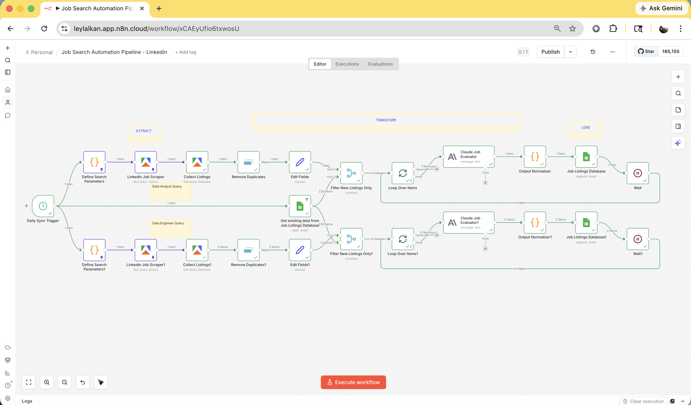
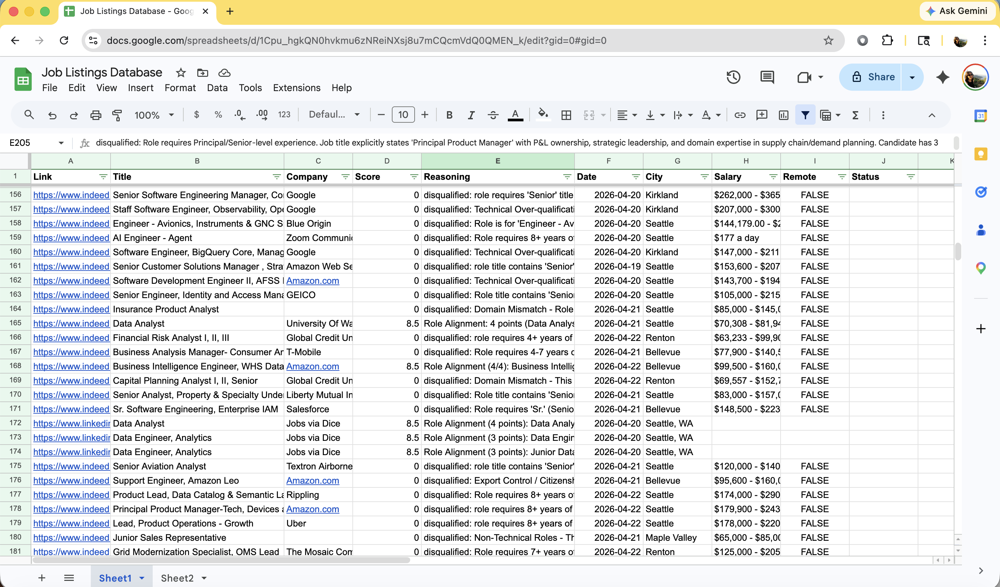

# Job Search Automation Pipeline

An automated job search pipeline built with n8n that scrapes Indeed and LinkedIn daily, filters out irrelevant listings, scores each one using Claude AI, and logs results to a Google Sheet, so I spend time applying to good fits.

---

## Background

After spending way too many hours manually browsing job boards, I decided to just build something to handle that part. This pipeline runs every morning, pulls fresh listings from Indeed and LinkedIn, checks them against what's already in my database, and has Claude evaluate each new one against my resume and target role criteria. By the time I open my laptop, there's already a scored and reasoned list waiting for me.
It's also been a good excuse to get hands-on with n8n, the Apify platform, and agentic AI workflows.

---

## How It Works

The project consists of two separate n8n workflows, one for Indeed and one for LinkedIn, both feeding into the same Google Sheet and using the same Claude scoring logic. The structures are slightly different to account for how each platform works, but the overall approach is the same: scrape, deduplicate, filter against the existing database, trim fields, limit the batch, score with Claude, and append to the sheet.

## Ineed Pipeline

Runs two parallel search queries targeting data analyst and data engineer roles in the Seattle area. Each query pulls listings from the last 24 hours, which then get deduplicated, filtered against the existing database, trimmed down to only the fields Claude needs. From there a loop processes all remaining listings in batches of 15, sending each batch through Claude for scoring and writing the results to the sheet before moving on to the next, until every listing has been evaluated.

## Linkedin Pipeline

Follows the same structure as the Indeed pipeline but LinkedIn proved to be a noisier source to work with. The scraper kept pulling in roles that were technically adjacent but completely off target, so getting the query to a point where it returned relevant results consistently required a lot more iteration than expected. Tight title filtering ended up being the fix, though it's more of a workaround than a clean solution given the platform's limitations.

There's also a deeper constraint with how LinkedIn scraping works in general: without an authenticated session, the results are fundamentally limited compared to what the platform actually has available. This means the pipeline may only surface a fraction of what's actually out there on any given day. Until a more reliable scraping approach is available, Indeed carries more of the sourcing weight.

### Node Breakdown

**Daily Sync Trigger**
Fires at 8:00 AM every day. It's a schedule trigger that kicks off the rest of the workflow.

**Define Search Parameters**
Defines what to look for before anything gets scraped. The Indeed workflow runs two configs in parallel to cover a broader range of target roles, while the LinkedIn workflow runs a single more tightly scoped query.

**Data Scraper (Apify)**
Handles the actual scraping by calling an Apify actor for each platform. Configured to only pull listings from the last 24 hours so the pipeline stays focused on what's new.

**Collect Listings (Apify)**
Picks up the scraped results from Apify's dataset and passes them into the rest of the pipeline.

**Remove Duplicates**
Runs right after collection, before anything else processes the data. Uses the `job URL` as the unique identifier to catch any listings that appeared more than once in the batch, whether that's because the same job showed up across multiple search queries or because the source platform listed it multiple times.

**Edit Fields**
Strips each listing down to only the fields Claude actually needs for scoring. Keeps the payload clean and the prompt focused.

**Get Existing Data from Job Listings Database**
Reads the current contents of the Google Sheet before any new data is written. This is the snapshot used for deduplication.

**Filter New Listings Only**
Merges the scraped batch against the existing sheet using `jobUrl` vs `Link` as the matching key. Only listings that don't already exist in the sheet pass through.

**Loop Over Items**
Feeds Claude a manageable chunk of listings at a time rather than all at once, which prevents the workflow from erroring out mid-run, so limiting the throughput keeps things stable and the costs predictable.

**Claude Job Evaluator**
The core of the pipeline. Sends each listing to `claude-haiku-4-5-20251001` with a structured prompt containing the title, company name, full job description, salary, location, benefits etc alongside my resume and target role criteria. Claude scores each listing out of 10 using a custom rubric (see [Scoring Logic](#scoring-logic) below) and returns a JSON object with a `score` and `reasoning` field.

**Output Normalizer**
Cleans up Claude's response before it moves downstream. Handles any formatting inconsistencies so the data is always structured and ready to write.

**Append to Job Listings Database**
Writes each evaluated listing as a new row in the Google Sheet, mapping fields manually: link, title, company, score, reasoning, date, city, salary, remote status.

**Wait (Optional)**
The Wait node at the end of each cycle adds a small breathing room between iterations.

---

## Scoring Logic

Claude evaluates each listing against a rubric I designed around my specific job search situation. Roles are **immediately disqualified** (score = 0) for any of the following:

- US Citizenship, Security Clearance, or ITAR/Export Control requirements
- Domain-specific experience required in an industry I haven't worked in (healthcare, insurance, gaming, biotech, etc.)
- Master's or PhD listed as a minimum or required qualification
- Purely non-technical or administrative roles
- On-site or hybrid roles more than 25 miles from Seattle (fully remote roles skip this check)
- ...among other criteria specific to my search

Listings that pass disqualification are scored across four dimensions:

| Category | Max Points | Notes |
|---|---|---|
| Role Alignment | 4 | DA/BI Analyst = 4pts; Analytics/Data Engineer = 3pts |
| Technical Growth Exposure | 3 | Additive: ETL/pipelines/dbt/cloud (1.5), SQL/Python (1), BI tools (0.5) |
| Work Quality | 1 | Remote or hybrid (0.5) plus benefits listed (0.5) |
| Compensation | 1 | Salary at or above a minimum threshold; unlisted treated as neutral |
| *...additional dimensions weighted by search priorities* | | |

The reasoning behind the design: I'm a data analyst transitioning toward analytics and data engineering, so I wanted to weight roles that give genuine exposure to ETL, data modeling, and cloud tooling rather than just roles that match my past experience on paper.

---

## Stack

| Tool | Role |
|---|---|
| n8n | Workflow orchestration |
| Apify | Data scraping |
| Claude Haiku | Job scoring and reasoning |
| Google Sheets | Job listings database |

---

## Output

Results land in a Google Sheet with the following columns:

`Link | Title | Company | Score | Reasoning | Date | City | Salary | Remote`

The `Status` column is for tracking whether I've applied a listing or not.

